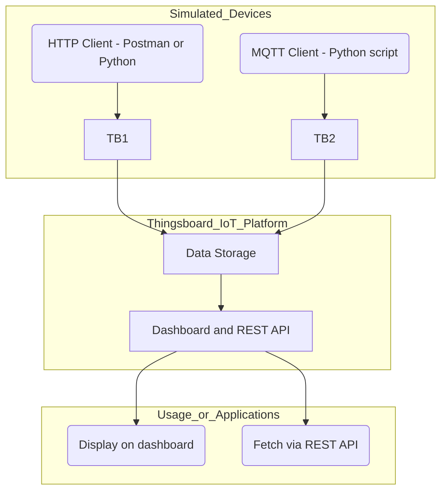

# 🧠 Smart Kitchen IoT Platform (Thingsboard)

This project implements a lightweight IoT platform using **Thingsboard**, simulating realistic kitchen-related devices and data. It includes device registration, data transmission using both **HTTP** and **MQTT** protocols, data visualization through dashboards, and API access.

---

## 🧪 Devices and Data Flow

We simulate two IoT "devices" with meaningful and realistic measurements:

### 📷 1. Smart Shopping Camera (HTTP)
A simulated camera reads handwritten shopping lists from a kitchen whiteboard every 10 minutes and sends recognized text to the IoT platform.

Example data sent via HTTP:
```json
{
  "shopping_note": "osta 2 tomaattia, osta maito"
}

```

### 🧊 2. Smart Fridge Inventory (MQTT)

A simulated fridge tracks what's currently inside and sends this data via MQTT.

Example data sent via MQTT:

```json
{
  "items": ["maito", "juusto", "tomaatti"],
  "timestamp": "2025-05-07T14:10:00"
}

```

----------

## 🧱 Architecture



----------

## 👥 Task Distribution (3-person team)

Each member has a well-defined responsibility:

### 👨‍💻 Member 1 – _Web & Simulation_

-   Hosts and develops a small web page to explain the system
    
-   Creates and runs the scripts that send HTTP and MQTT data every 10 minutes
    
-   Manages connection to Thingsboard (tokens, endpoints)
    

### 📊 Member 2 – _Thingsboard & Dashboard_

-   Installs or configures the Thingsboard platform (local or hosted)
    
-   Registers devices and sets up access tokens
    
-   Designs dashboards to visualize:
    
    -   Shopping notes
        
    -   Inventory contents
        
-   Configures widgets and tests visual updates
    

### 📝 Member 3 – _Documentation & API_

-   Writes project documentation (e.g. this README, final report)
    
-   Documents how to retrieve data via Thingsboard REST API
    
-   Verifies and documents how to reproduce and test the project
    
-   Takes screenshots of working system for report
    

----------

## 🚀 Technologies Used

-   [Thingsboard](https://thingsboard.io/) – Open-source IoT platform
    
-   Python (requests + paho-mqtt)
    
-   Postman or MQTTX (for testing)
    
-   REST API and MQTT Broker (Thingsboard built-in)
    

----------

## 📦 How to Run

1.  Install or access Thingsboard (see: [https://thingsboard.io/docs](https://thingsboard.io/docs))
    
2.  Register two devices:
    
    -   `smart_camera` (HTTP)
        
    -   `smart_fridge` (MQTT)
        
3.  Generate their access tokens
    
4.  Run the Python scripts or Postman/MQTTX to send data
    
5.  Create a dashboard in Thingsboard to visualize the incoming data
    
6.  Optionally, retrieve latest data via REST API
    

----------

## 🧪 Example API Call (retrieve last known fridge data)

```bash
curl -X GET \
  http://<THINGSBOARD_URL>/api/plugins/telemetry/DEVICE_ID/values/timeseries \
  -H "X-Authorization: Bearer <JWT_TOKEN>"

```

----------

## 📸 Screenshots

_Add screenshots here of:_

-   Devices in Thingsboard
    
-   Received data in telemetry
    
-   Dashboard views (e.g., shopping list text, fridge contents)
    

----------

## 🧠 Reflection

This project demonstrates how a simple and fun idea can be transformed into a fully working IoT prototype using real protocols, simulated sensors, and open-source tools. It reinforces understanding of the IoT architecture, device management, protocol use, and data visualization.

----------

## 🛠️ Future Ideas

-   Add OCR integration for real image recognition
    
-   Expand fridge simulation with weight sensors or expiration dates
    
-   Add alerts (e.g., "maito loppuu", "osta lisää juustoa")
